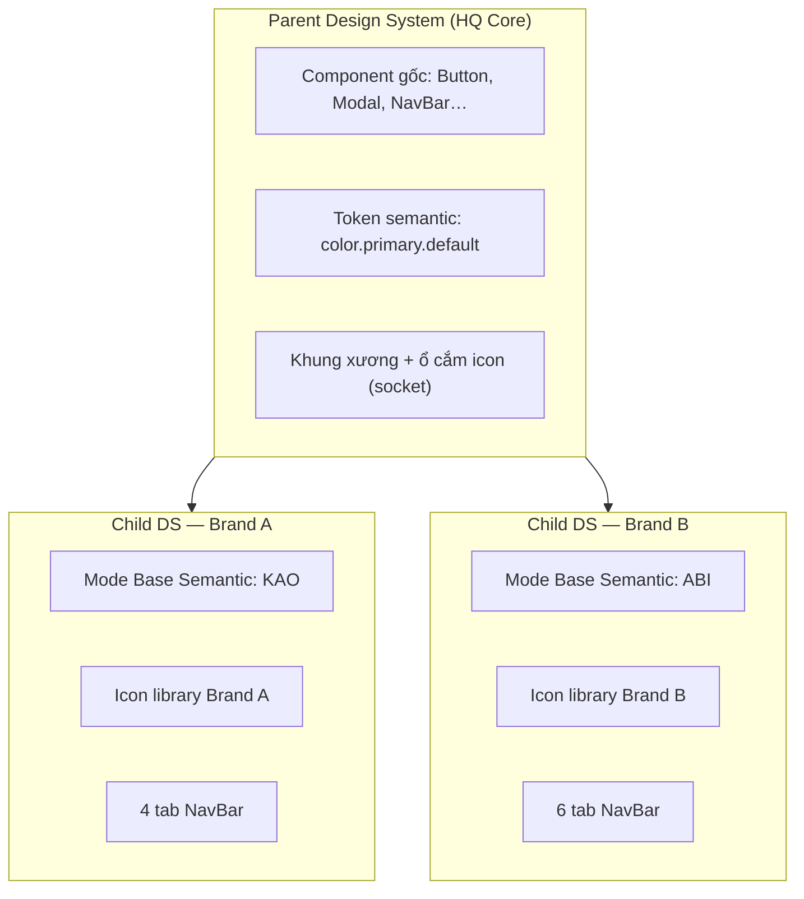
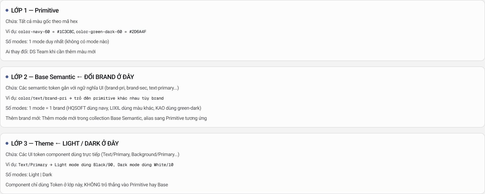
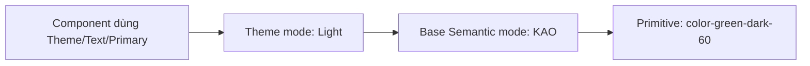
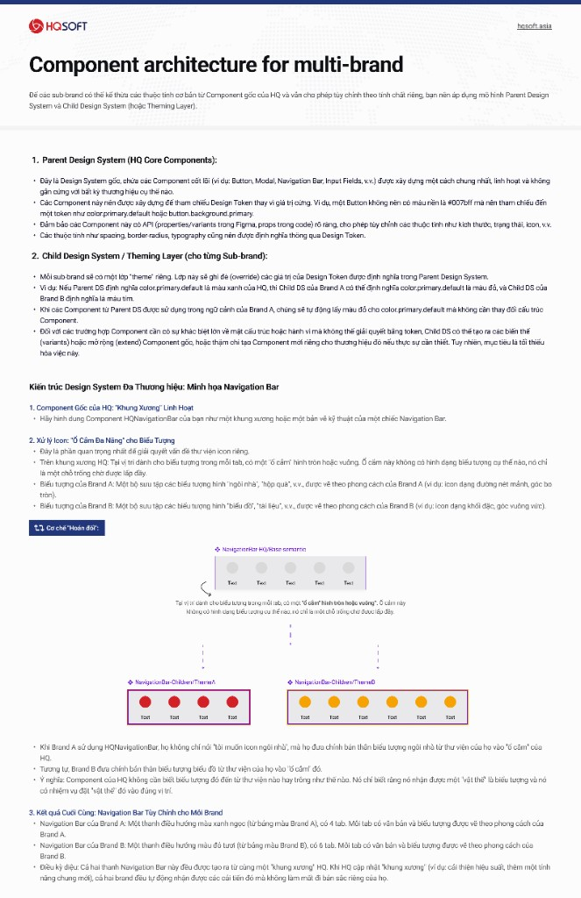
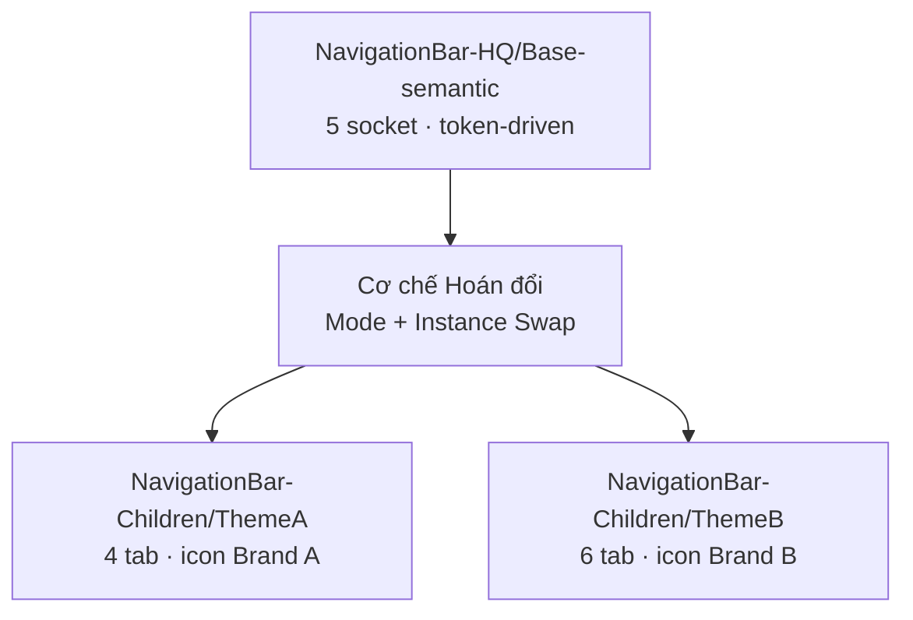
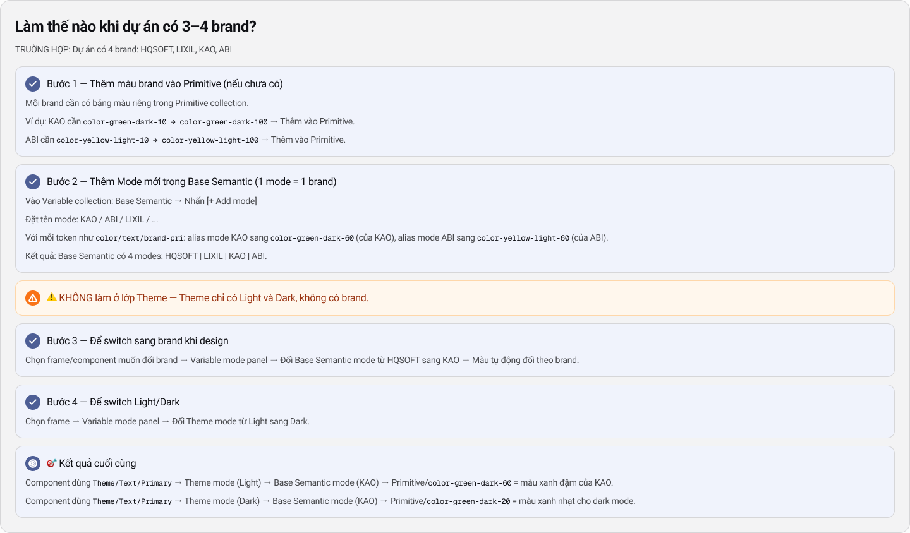

# Case Study: Cấu trúc Multi-brand cho công ty có nhiều khách hàng

> **Nguồn tham chiếu:** [UI-UX Self Learn Knowledge — Global design token](https://www.figma.com/design/DLwGliZZryr60igITq1pfS/UI-UX-Self-Learn-Knowledge?node-id=459-8816)  
> **Đối tượng:** Fresher · Junior · Middle Designer  
> **Mục tiêu:** Hiểu và thực hành được kiến trúc Parent–Child + Token 3 lớp để switch brand trong Figma chỉ bằng đổi mode — không detach, không sửa hex từng component.

---

## 1. Bối cảnh — Vì sao cần Multi-brand?

HQSOFT vận hành nhiều sản phẩm enterprise (SaaS / ERP / DMS) cho **nhiều khách hàng cùng lúc**: HQSOFT, LIXIL, KAO, ABI, Sabeco, AVN-TT, PVM, FES… Mỗi khách hàng có **bảng màu, icon, typography** riêng, nhưng **luồng nghiệp vụ và cấu trúc UI** gần như giống nhau.

### Vấn đề nếu không có kiến trúc

| Cách làm cũ | Hậu quả |
|---|---|
| Clone file Figma cho từng brand | Bug fix phải sửa N file; drift nhanh |
| Hardcode màu `#007bff` trong component | Đổi brand = sửa từng layer |
| Tạo component mới cho mỗi khách | Thư viện phình, mất consistency |
| Detach instance để custom | Mất link với DS gốc, không scale |

### Mục tiêu kiến trúc

> **Design once, brand many.**  
> Một bộ component gốc (Parent) + nhiều lớp theme (Child) → switch brand trong Figma bằng **Variable mode**, không đụng cấu trúc component.

---

## 2. Tổng quan kiến trúc — Parent & Child

Kiến trúc chia thành **hai trục song song**:

1. **Token 3 lớp** — xử lý **màu sắc, spacing, typography** (phần “da” / skin).
2. **Component Skeleton + Socket** — xử lý **cấu trúc, icon, số lượng tab** (phần “xương” / skeleton).



### 2.1 Parent Design System — “Khung xương”

Đây là Design System gốc, chứa component cốt lõi được xây **chung nhất, linh hoạt, không gắn cứng brand**:

- Button, Modal, Navigation Bar, Input Fields…
- **Không hardcode hex** — tham chiếu token: `color.primary.default`, `button.background.primary`
- Có **API rõ ràng** (properties / variants trong Figma): size, state, icon, số tab…
- Spacing, radius, typography đều qua **Design Token**

### 2.2 Child Design System — “Lớp theme”

Mỗi sub-brand có lớp theme riêng, **ghi đè (override)** giá trị token của Parent:

| Token Parent | Brand A (KAO) | Brand B (ABI) |
|---|---|---|
| `color.primary.default` | `color-green-dark-60` | `color-yellow-light-60` |
| `color.text.brand-pri` | Xanh đậm KAO | Vàng ABI |
| Icon socket | Bộ icon line, bo tròn | Bộ icon solid, góc vuông |

**Điểm mấu chốt:** Component Parent **không đổi cấu trúc** — chỉ đổi **ngữ cảnh mode** khi render.

> Chỉ khi khác biệt **về cấu trúc hoặc hành vi** mà token không giải quyết được, Child DS mới tạo variant / extend / component mới. **Mục tiêu: tối thiểu hóa.**

---

## 3. Token 3 lớp — Đổi brand ở lớp Base Semantic

Đây là phần quan trọng nhất để **switch brand trong Figma**. Ba collection tách biệt, mỗi lớp một nhiệm vụ.



### Lớp 1 — Primitive

| Thuộc tính | Giá trị |
|---|---|
| **Chứa** | Tất cả màu gốc theo hex |
| **Ví dụ** | `color-navy-60 = #1C3C8C`, `color-green-dark-60 = #2D6A4F` |
| **Số mode** | **1 mode duy nhất** (không có mode) |
| **Ai sửa** | DS Team khi cần thêm palette mới |

Primitive là **kho màu thô** — designer **không** bind trực tiếp vào component.

### Lớp 2 — Base Semantic ← **ĐỔI BRAND Ở ĐÂY**

| Thuộc tính | Giá trị |
|---|---|
| **Chứa** | Semantic token gắn ngữ nghĩa UI: `brand-pri`, `brand-sec`, `text-primary`… |
| **Ví dụ** | `color/text/brand-pri` → alias sang primitive **khác nhau tùy brand** |
| **Số mode** | **1 mode = 1 brand** (HQSOFT, LIXIL, KAO, ABI…) |
| **Thêm brand** | Add mode mới trong collection Base Semantic |

Đây là lớp bạn switch khi design cho khách hàng khác.

### Lớp 3 — Theme ← **LIGHT / DARK Ở ĐÂY**

| Thuộc tính | Giá trị |
|---|---|
| **Chứa** | UI token component dùng trực tiếp: `Text/Primary`, `Background/Primary`… |
| **Ví dụ** | `Text/Primary` → Light: `Black/90`, Dark: `White/10` |
| **Số mode** | **Light \| Dark** |
| **Quy tắc** | Component **chỉ** dùng token lớp này |

### Chuỗi resolve khi render



**Ví dụ cụ thể:**

- `Theme/Text/Primary` → Theme **Light** → Base Semantic **KAO** → `color-green-dark-60` = xanh đậm KAO
- `Theme/Text/Primary` → Theme **Dark** → Base Semantic **KAO** → `color-green-dark-20` = xanh nhạt cho dark mode

### ⚠️ Ghi nhớ quan trọng

> **Tất cả component chỉ dùng Theme tokens — KHÔNG trỏ trực tiếp vào Primitive hay Base Semantic.**  
> Khi thêm sub-brand mới: chỉ cần **thêm mode trong Base Semantic** — Theme và component **không cần đổi**.

---

## 4. Component Skeleton + Socket — Ví dụ Navigation Bar

Token xử lý **màu**. Nhưng multi-brand còn cần xử lý **icon library khác nhau** và **số tab khác nhau**. Đây là vai trò của **Skeleton + Socket**.



### 4.1 Khung xương HQ (`NavigationBar-HQ/Base-semantic`)

Hình dung `HQNavigationBar` như **bản vẽ kỹ thuật**:

- Có vị trí cố định cho icon + label mỗi tab
- **Ổ cắm (socket)** hình tròn/vuông — **không** có icon cụ thể, chỉ là placeholder
- Màu nền, text, border bind **Theme token** — không hex cứng
- Variant: số tab (4 / 5 / 6), trạng thái active/inactive

### 4.2 Ổ cắm đa năng cho Icon

| Brand | Icon library | Phong cách |
|---|---|---|
| Brand A | Ngôi nhà, hộp quà… | Line mảnh, góc bo tròn |
| Brand B | Biểu đồ, tài liệu… | Solid, góc vuông |

**Cơ chế hoán đổi:**

1. Brand A **không** nói “tôi muốn icon ngôi nhà” bằng cách sửa component gốc
2. Brand A **đưa icon từ thư viện riêng** vào **socket** của HQ (Instance swap / slot property)
3. Component HQ **không cần biết** icon đến từ đâu — chỉ biết có “vật thể icon” cần đặt đúng vị trí

### 4.3 Kết quả sau khi hoán đổi

| | Brand A (ThemeA) | Brand B (ThemeB) |
|---|---|---|
| Màu thanh | Xanh ngọc (palette A) | Đỏ tươi (palette B) |
| Số tab | 4 | 6 |
| Icon | Phong cách A | Phong cách B |
| Nguồn gốc | **Cùng** `HQNavigationBar` | **Cùng** `HQNavigationBar` |

**Điều kỳ diệu:** Khi HQ cập nhật skeleton (animation, a11y, bug fix) → **cả hai brand nhận cập nhật** mà không mất bản sắc riêng.



---

## 5. Hướng dẫn thực hành — Dự án có 3–4 brand

**Trường hợp:** Dự án có 4 brand: **HQSOFT · LIXIL · KAO · ABI**



### Bước 1 — Thêm màu brand vào Primitive (nếu chưa có)

Mỗi brand cần palette riêng trong collection **Primitive**:

```
KAO  → color-green-dark-10 … color-green-dark-100
ABI  → color-yellow-light-10 … color-yellow-light-100
LIXIL → (palette riêng)
```

✅ Chỉ DS Team thêm palette mới  
❌ Designer dự án không tự chế hex trong component

### Bước 2 — Thêm Mode mới trong Base Semantic

1. Mở **Variables** → collection `Base Semantic`
2. Nhấn **[+ Add mode]**
3. Đặt tên: `KAO`, `ABI`, `LIXIL`…
4. Với mỗi token `color/text/brand-pri`:
   - Mode **HQSOFT** → alias `color-navy-60`
   - Mode **KAO** → alias `color-green-dark-60`
   - Mode **ABI** → alias `color-yellow-light-60`

**Kết quả:** Base Semantic có 4 modes: `HQSOFT | LIXIL | KAO | ABI`

### ⚠️ KHÔNG làm ở lớp Theme

> Theme **chỉ** có **Light** và **Dark** — **không** có brand.  
> Nhầm lẫn này là lỗi phổ biến nhất của fresher/junior.

### Bước 3 — Switch brand khi design

1. Chọn frame / component cần đổi brand
2. Panel **Variable modes** (bên phải Figma)
3. Đổi **Base Semantic** mode: `HQSOFT` → `KAO`
4. Màu tự động đổi theo brand — **không detach**

### Bước 4 — Switch Light / Dark

1. Chọn frame
2. Đổi **Theme** mode: `Light` → `Dark`
3. Component giữ nguyên cấu trúc, contrast tự resolve qua token

### Kết quả cuối cùng

```
Component → Theme/Text/Primary
         → Theme mode (Light)
         → Base Semantic mode (KAO)
         → Primitive color-green-dark-60
         = Màu primary của KAO trên nền sáng ✓
```

---

## 6. Lộ trình theo level Designer

### Fresher — Hiểu & làm đúng quy tắc

**Cần nắm:**

- 3 lớp token và **component chỉ dùng Theme**
- Brand switch = đổi **Base Semantic mode**, không sửa hex
- Không detach instance Parent để đổi màu

**Bài tập:**

1. Mở file DS → tìm 1 Button → kiểm tra fill đang bind token nào (phải là Theme, không phải Primitive)
2. Tạo frame test → switch Base Semantic HQSOFT ↔ KAO → chụp before/after
3. Thử switch Theme Light ↔ Dark trên cùng frame

**Checklist pass:**

- [ ] Giải thích được 3 lớp token bằng lời của mình
- [ ] Biết brand nằm ở Base Semantic, không phải Theme
- [ ] Switch được mode mà không detach

### Junior — Thiết kế screen multi-brand

**Cần nắm thêm:**

- Skeleton + socket cho icon (instance swap)
- Khi nào dùng variant vs khi nào cần component Child riêng
- Đặt tên component: `NavigationBar-HQ/Base-semantic` vs `NavigationBar-Children/ThemeA`

**Bài tập:**

1. Dùng `HQNavigationBar` → tạo 2 instance cho Brand A và Brand B
2. Swap icon qua socket, đổi số tab bằng variant
3. Switch Base Semantic mode → verify màu đổi đồng bộ trên toàn frame
4. Document lại: token nào dùng cho background bar, label, active state

**Checklist pass:**

- [ ] Tạo được 2 branded NavBar từ 1 component gốc
- [ ] Icon swap không phá layout auto-layout
- [ ] Không còn hex “lọt” ngoài token

### Middle — Mở rộng & govern

**Cần nắm thêm:**

- Quy trình onboard brand mới (Primitive → Base mode → test matrix)
- Audit component: token compliance, socket coverage
- Phối hợp dev: token naming sync Figma ↔ CSS

**Bài tập:**

1. Thêm brand giả định **Brand X** (chọn 1 palette mới vào Primitive + 1 mode Base Semantic)
2. Chạy audit 10 component: liệt kê component nào còn hardcode
3. Viết 1-page guideline “Khi nào được tạo Child component mới” cho team

**Checklist pass:**

- [ ] Onboard brand mới < 2h (chỉ token, không sửa component)
- [ ] Có matrix test: 4 brand × 2 theme = 8 combination
- [ ] Guideline được team junior áp dụng được

---

## 7. Ma trận quyết định — Token vs Variant vs Component mới

| Mức độ khác biệt | Giải pháp | Ví dụ |
|---|---|---|
| Chỉ khác màu | **Base Semantic mode** | KAO xanh, ABI vàng |
| Khác Light/Dark | **Theme mode** | Cùng brand, nền tối |
| Khác icon style | **Socket + Instance swap** | Line vs solid icon |
| Khác số tab / layout nhỏ | **Variant property** | NavBar 4 tab vs 6 tab |
| Khác cấu trúc lớn | **Extend / Child variant** | Thêm slot badge trên NavBar |
| Hoàn toàn khác UX | **Component Child riêng** (hiếm) | NavBar dạng sidebar thay bottom bar |

**Nguyên tắc 80/20:** 80% custom multi-brand chỉ cần **đổi Base Semantic mode + swap icon**.

---

## 8. Anti-patterns — Những lỗi cần tránh

| ❌ Sai | ✅ Đúng |
|---|---|
| Tạo `Button-KAO`, `Button-ABI` riêng | 1 `Button` + switch Base Semantic mode |
| Thêm brand mode vào collection Theme | Brand ở Base Semantic; Theme chỉ Light/Dark |
| Detach NavBar để đổi màu nhanh | Đổi Variable mode trên instance |
| Hardcode icon trong component gốc | Socket + instance swap theo brand |
| Designer tự thêm hex trong screen | Yêu cầu DS Team thêm Primitive trước |
| Clone cả file Figma per client | 1 file Parent + mode per brand |

---

## 9. Checklist trước khi handoff Dev

- [ ] Mọi fill/text/stroke trong component bind **Theme token**
- [ ] Không còn hex raw trong layer (trừ Primitive collection)
- [ ] Frame handoff set đúng **2 mode**: Base Semantic (brand) + Theme (light/dark)
- [ ] Icon dùng socket — dev map được sang `icon` prop / slot
- [ ] Tên token Figma khớp convention code (`Text/Primary` ↔ `--color-text-primary`)
- [ ] Đã test ít nhất 2 brand trên cùng screen

---

## 10. Tóm tắt một câu

> **Parent DS giữ xương + API; Base Semantic giữ brand; Theme giữ light/dark; Socket giữ icon.**  
> Đổi khách hàng = đổi mode + plug icon — không vẽ lại từ đầu.

---

## Tài liệu liên quan

- [HQSOFT Design System case study](../hqsoft-design-system/case-study-hqsoft-design-system.html)
- [Figma — Global design token (Knowledge)](https://www.figma.com/design/DLwGliZZryr60igITq1pfS/UI-UX-Self-Learn-Knowledge?node-id=459-8816)
- [Figma — Architecture components for multi-brand](https://www.figma.com/design/DLwGliZZryr60igITq1pfS/UI-UX-Self-Learn-Knowledge?node-id=105-2802)

---

*Cập nhật: 2026-06-26 · HQSOFT Design System Team*
